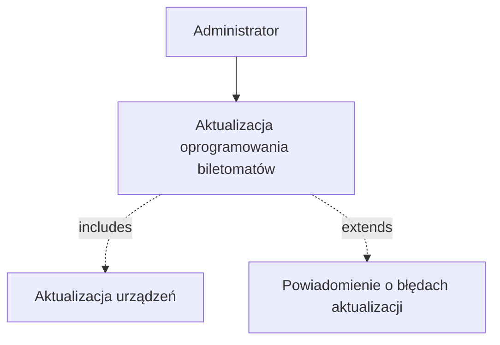
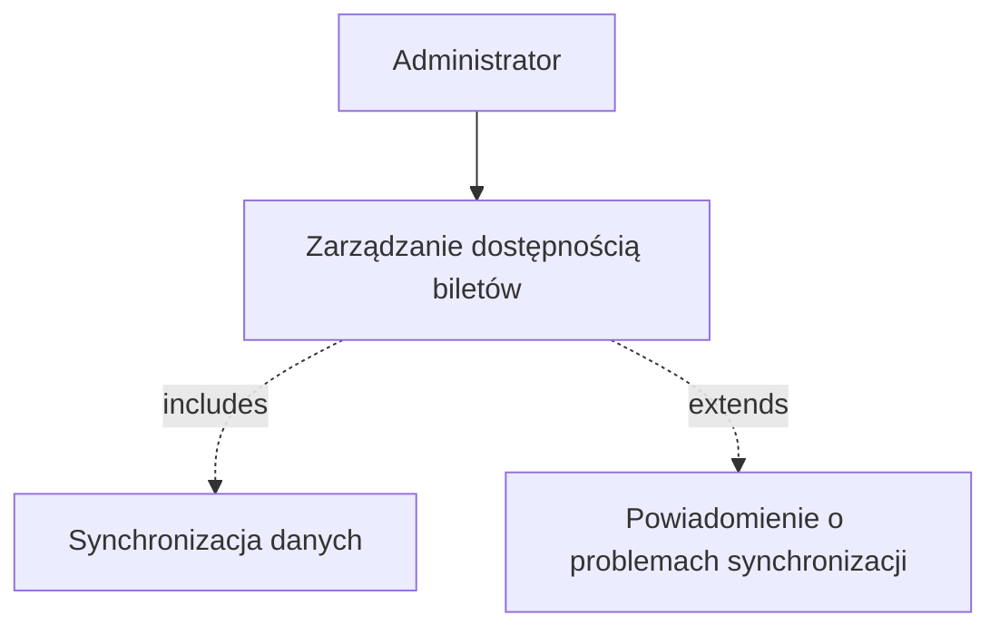
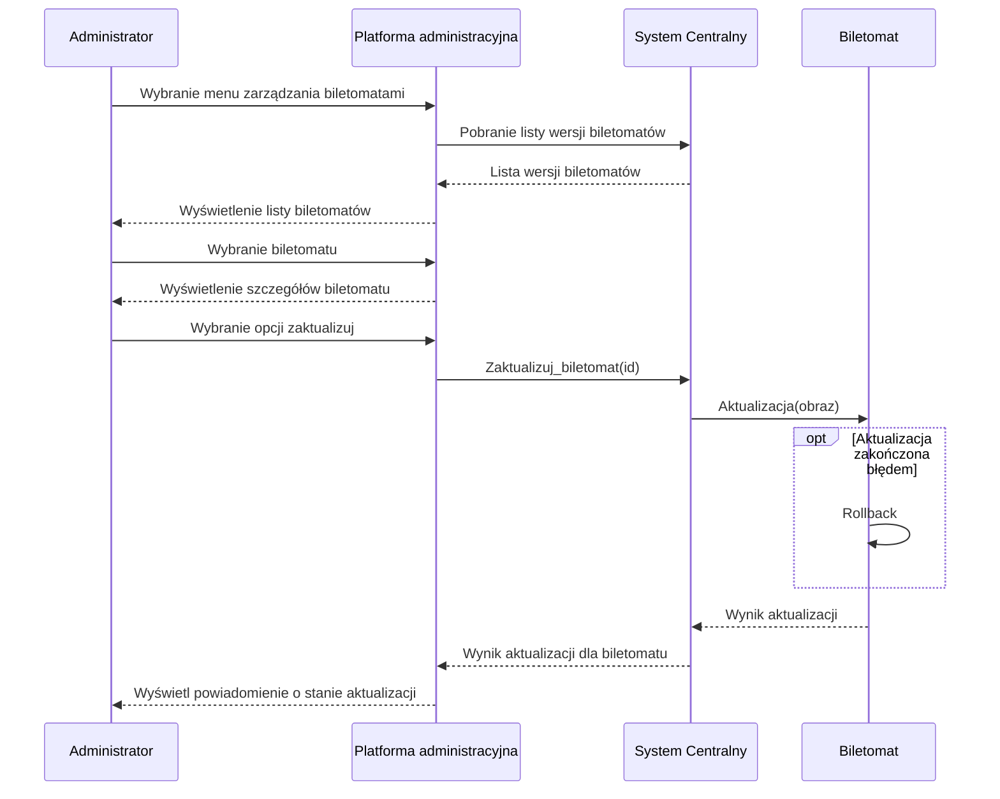

1. Jako administrator, chcę zdalnie aktualizować oprogramowanie biletomatów,
aby zapewnić zgodność z nowymi wymogami i funkcjonalnościami.
2. Jako administrator, chcę mieć dostęp do raportów sprzedaży w czasie
rzeczywistym, aby monitorować wyniki finansowe.
3. Jako administrator, chcę konfigurować dostępne bilety, promocje i taryfy w
systemie centralnym, aby odzwierciedlać zmiany w ofercie.

## Diagramy przypadków użycia
### Aktualizacja oprogramowania

### Zarządzanie dostępnością biletów

## Diagramy sekwencji
### Aktualizacja oprogramowania
