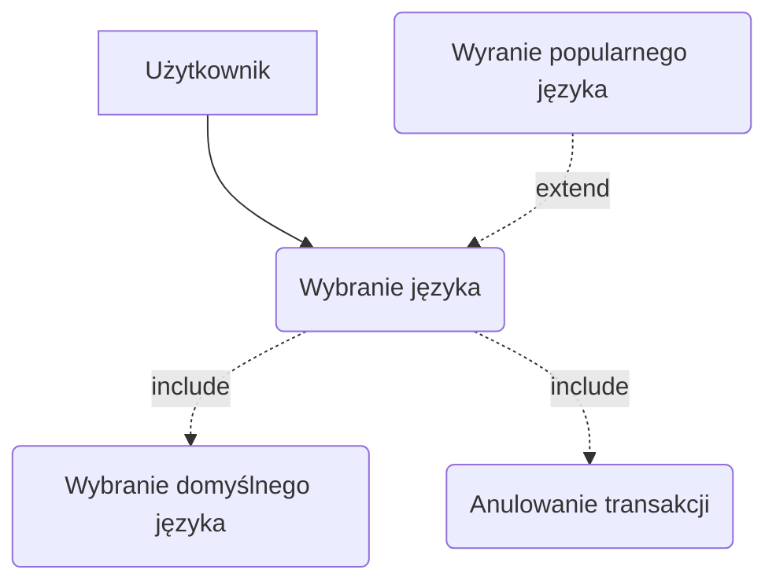
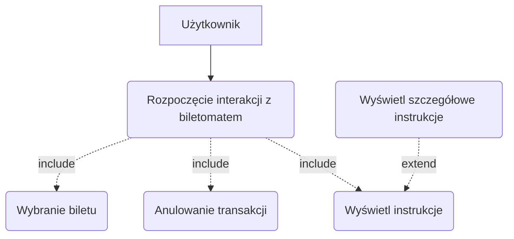
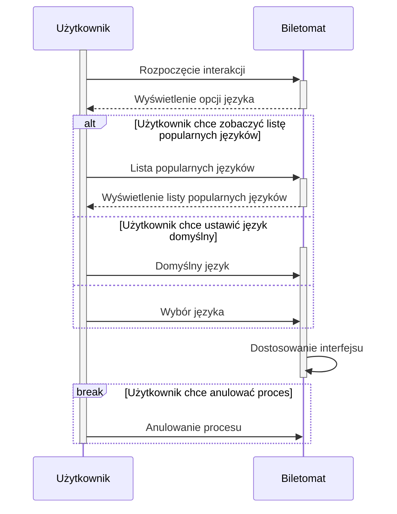
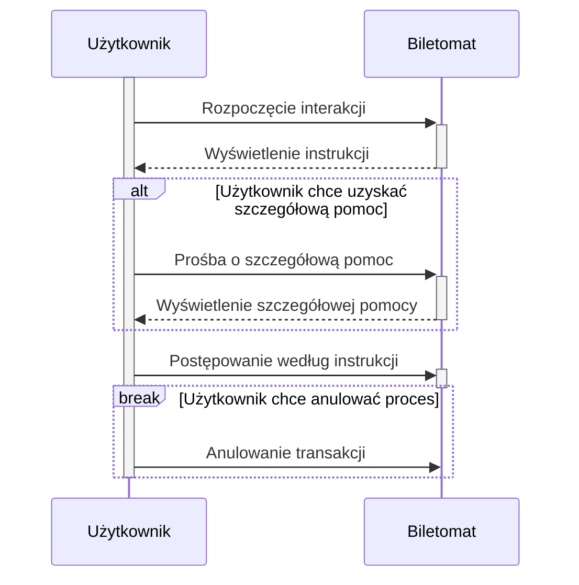
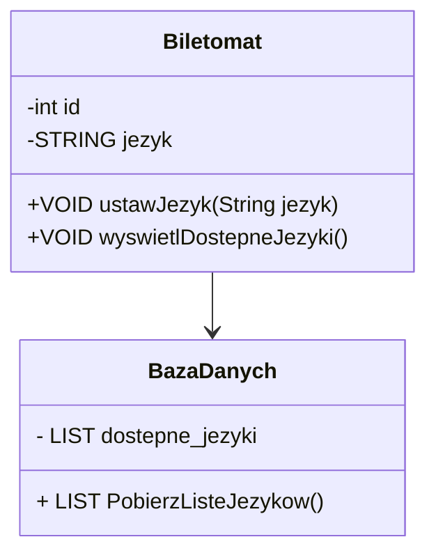

1. Jako użytkownik, chcę płacić za bilet kartą, gotówką lub telefonem, aby mieć
większą elastyczność w wyborze metody płatności.
2. Jako użytkownik, chcę otrzymać wyraźne instrukcje na ekranie, aby wiedzieć,
jak dokonać zakupu krok po kroku.
3. Jako użytkownik, chcę widzieć czas pozostały na decyzję (np. wyświetlany
licznik czasu), aby móc szybko podjąć działanie.
4. Jako użytkownik, chcę szybko wybrać rodzaj biletu, aby zminimalizować czas
spędzony przy biletomacie.
5. Jako użytkownik, chcę mieć możliwość wyboru języka, aby móc korzystać z
biletomatu bez względu na znajomość języka lokalnego.
6. Jako użytkownik, chcę sprawdzić poprawność transakcji przed jej finalizacją,
aby uniknąć pomyłek.
7. Jako użytkownik, chcę otrzymać potwierdzenie zakupu (np. wydruk biletu lub
elektroniczny bilet), aby móc korzystać z transportu zgodnie z przepisami.

## Diagramy przypadków użycia
### Wybór języka

### Wyświetlenie instrukcji

## Diagramy sekwencji

### Diagram sekwencji dla przypadku użycia Wybór języka

- Aktor: Użytkownik
- Obiekty: Biletomat
- Kolejność komunikatów:
    * Użytkownik uruchamia biletomat
    * System wyświetla ekran powitalny z opcjami wyboru języka
    * Użytkownik wybiera preferowany język
    * System dostosowywuje interfejs do wybranego języka
- Scenariusz alternatywny 1 (Anulowanie procesu):
    * Użytkownik w każdej chwili może anulować proces
- Scenariusz alternatywny 2 (Lista popularnych języków):
    * Użytkownik uruchamia biletomat
    * System wyświetla ekran powitalny z opcjami wyboru języka
    * Użytkownik wybiera opcję wyświetlenia listy popularnych języków
    * System wyświetla listę popularnych języków
    * Użytkownik wybiera preferowany język
    * System dostosowywuje interfejs do wybranego języka
- Scenariusz alternatywny 3 (Domyślny język):
    * Użytkownik uruchamia biletomat
    * System wyświetla ekran powitalny z opcjami wyboru języka
    * Użytkownik wybiera opcję ustawienia języka domyślnego
    * System dostosowywuje interfejs do wybranego języka

### Diagram sekwencji dla przypadku użycia Otrzymanie instrukcji na ekranie

- Aktor: Użytkownik
- Obiekty: Biletomat
- Kolejność komunikatów:
    * Użytkownik rozpoczyna interakcję z biletomatem
    * System wyświetla krokowe instrukcje na ekranie
    * Użytkownik podąża za wyświetlanymi wskazówkami, np. wybiera bilet, zatwierdza transakcję 
- Scenariusz alternatywny 1 (Anulowanie transakcji):
    * Użytkownik w każdej chwili może anulować proces
- Scenariusz alternatywny 2 (Szczegółówa pomoc)
    * Użytkownik rozpoczyna interakcję z biletomatem
    * System wyświetla krokowe instrukcje na ekranie
    * Użytkownik prosi o szczegółową pomoc
    * System wyświetla szczegółową pomoc
    * Użytkownik podąża za wyświetlanymi wskazówkami, np. wybiera bilet, zatwierdza transakcję 

## Opis klas

### Klasy

#### Biletomat
- ATRYBUTY: `int id`, `STRING jezyk` 
- METODY: `VOID ustawJezyk(String jezyk)`, `VOID wyswietlDostepneJezyki()`

#### Baza danych
- ATRYBUTY: `LIST<STRING> dostepne_jezyki`
- Metody: `LIST<String> PobierzListeJezykow()`

- Biletomat korzysta z bazy danych do weryfikacji dostępnych języków
- Baza danych zawiera instrukcje

### Diagram klas

