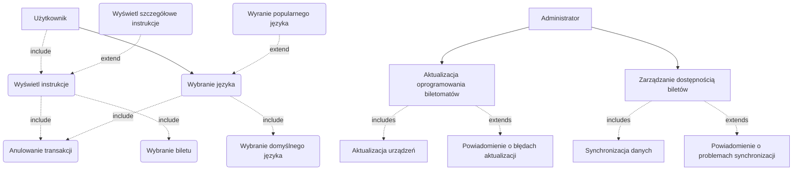

```mermaid
flowchart TD
U[Użytkownik]  -.-> |include| U_INS(Wyświetl instrukcje)

U_INS -.-> |include| UC_CANC(Anulowanie transakcji)

U_INS -.-> |include| U_WYB(Wybranie biletu)

U_SZCZ(Wyświetl szczegółowe instrukcje) -.-> |extend| U_INS

U[Użytkownik] --> UC_JZ(Wybranie języka)
UC_POP(Wyranie popularnego języka) -.-> |extend| UC_JZ 
UC_JZ -.-> |include| UC_DEF(Wybranie domyślnego języka)

UC_JZ -.-> |include| UC_CANC(Anulowanie transakcji)

Administrator --> uc11[Aktualizacja oprogramowania biletomatów]
uc11 -.includes.-> uc21[Aktualizacja urządzeń]
uc11 -.extends.-> uc31[Powiadomienie o błędach aktualizacji]
Administrator --> uc12[Zarządzanie dostępnością biletów]
uc12 -.includes.-> uc22[Synchronizacja danych]
uc12 -.extends.-> uc32[Powiadomienie o problemach synchronizacji]
```